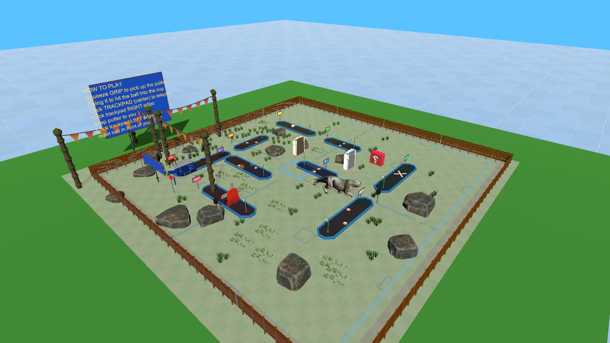
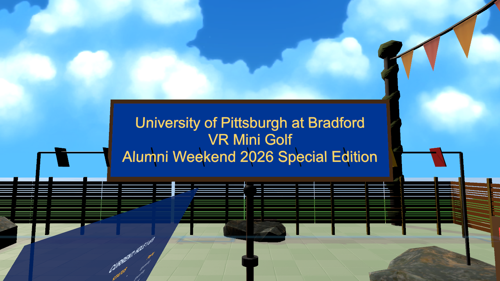
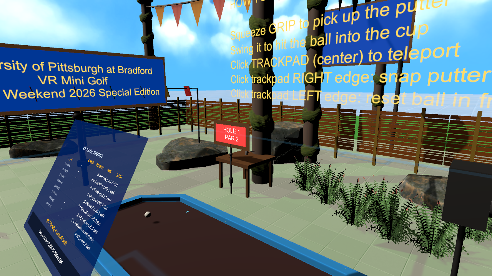
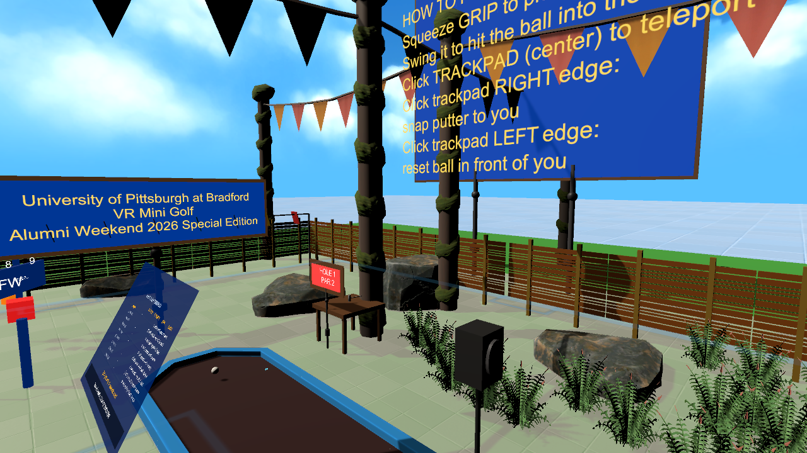
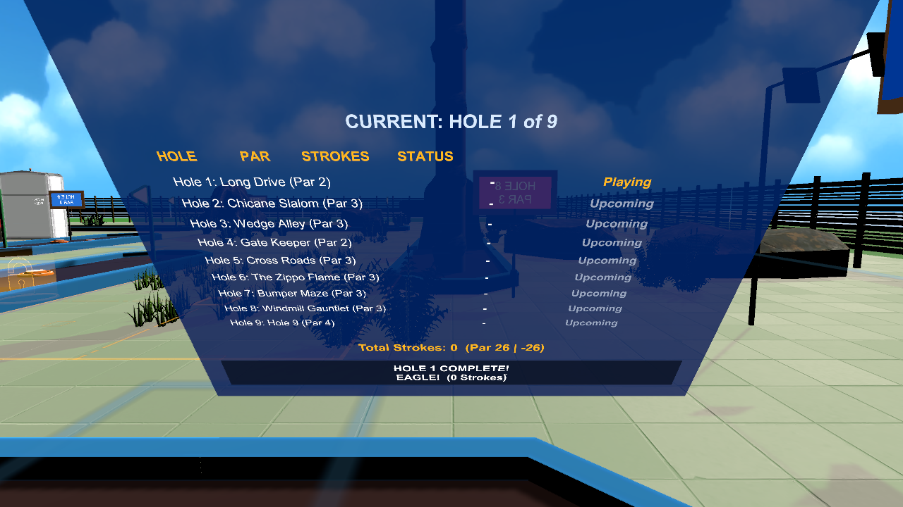
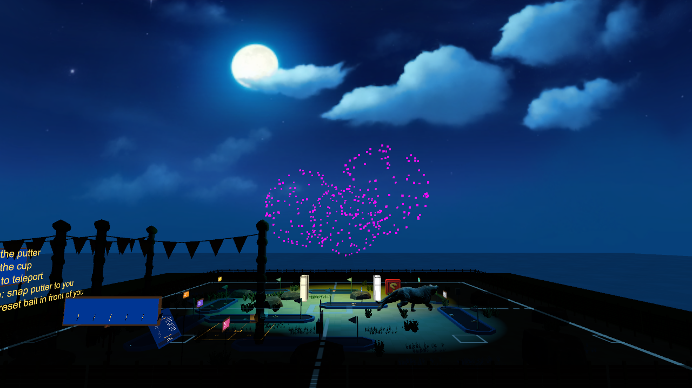
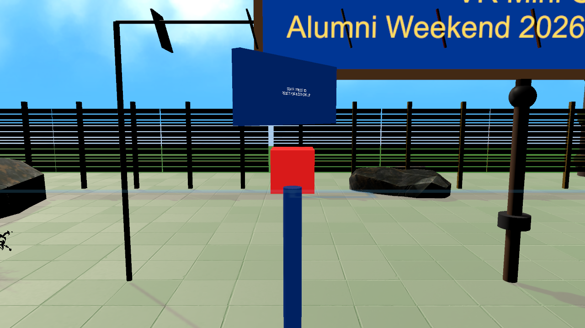
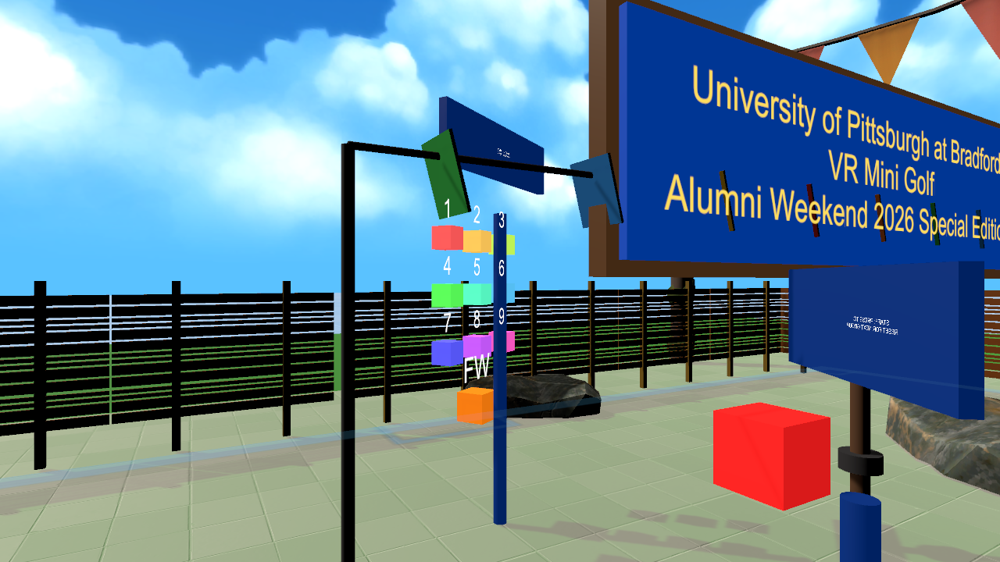

# GolfVR — University of Pittsburgh at Bradford Alumni Weekend 2026

A 9-hole VR mini-golf course built in Unity 2022.3.62f3 with SteamVR, for the HTC Vive Pro (Vive Wand controllers). Scene: `Assets/Scenes/ICARUS_v1.unity` (forked from `MiniGolf_AlumniCourse_v3.unity`, which is left untouched as the previous version).

## Controls (Vive Wand)

| Input | Action |
|---|---|
| Trigger | Grab / interact |
| Grip button | Pick up the putter -- it then stays stuck to that hand (no need to keep squeezing); only the reset kiosk lets go of it |
| Trackpad — center | Teleport |
| Trackpad — right edge | Snap putter to you (when not holding it) / while holding it: cycle the putter angle 0-15-30-45-60 degrees (remembered) |
| Trackpad — left edge | Reset ball in front of you |

These are also shown in-course on the "HOW TO PLAY" sign near Hole 1.

## Features

- **A ball at every hole**: each of the 9 holes has its own ball waiting at its tee (`GolfBall.holeIndex`; `MiniGolfGameManager` keeps one per hole). Nothing is carried or "advanced" from hole to hole any more: finish a hole, then go to any other one and putt the ball waiting there. Strokes and sinks are counted per ball, a hole only accepts its own ball, and the round ends when all nine are holed (in any order). The scoreboard follows the player to whichever tee they are standing near.
- **NEXT HOLE buttons**: a small post with an orange push-button beside every tee (`GoToHoleButton` -> `MiniGolfGameManager.GoToHole`) takes you to the next hole's tee (Hole 9 wraps to Hole 1) without resetting anything -- a reliable alternative to the arc teleport. Reset/sunk state and scores are kept.
- **9-hole course** with per-hole tee signs, par, and named holes ("Long Drive", "Chicane Slalom", "Windmill Gauntlet", ... "The Final Roar" for the Hole 9 finale).
- **Scoreboard** (world-space canvas) tracks strokes/par per hole and follows the player to whichever hole is active, showing a live "HOLE X COMPLETE!" banner with score terms (Hole in One, Eagle, Birdie, Par, Bogey) after each sink.
- **Beginner-friendly reset buttons** (`QuickResetController`) repurpose the unused SteamVR snap-turn actions: one snaps the putter back in front of the player, the other resets the ball in front of the player.
- **Fireworks celebration**: every hole sunk triggers confetti + victory fanfare (as before) plus a new sequence — the sky fades to a night skybox, 9 colorful firework bursts go off over ~7 seconds with light flashes, two procedural horn blasts play, then it fades back to day (`FireworksCelebrationController`).
- **Out-of-bounds handling**: a ball that falls off course gets a penalty stroke and resets to its last rest position.
- **Reset-for-next-group kiosk**: a physical push-button near the entrance plaza (`ResetRoundButton`, built on SteamVR's own proven push-button interaction rather than a hand-rolled one) lets event staff reset the whole round — scores, ball, and putter all snapped back to Hole 1 — between groups without relaunching the app.
- **"Pick a hole" testing panel**: right next to the reset kiosk, a 3x3 grid of 9 small buttons jumps straight to any hole (`JumpToHoleButton` → `MiniGolfGameManager.JumpToHole`), for testing a specific hole without playing through every one before it. Pressing the button for whichever hole is already active also works as a "put the ball and putter back" reset for just that hole. A 10th orange "FW" button plays the fireworks celebration directly (`TestFireworksButton`), so the show can be checked independently of the putter/sink working correctly.

## Screenshots

**Course overview**


**Entrance / welcome sign** (correctly facing the actual spawn point — see Bugs Found below)


**Instructions sign + Hole 1**


**Festive entrance plaza**


**Scoreboard + hole-complete banner**


**Night sky + fireworks show**


**Reset-for-next-group kiosk**


**"Pick a hole" testing panel**


The first six were captured headlessly (no live Editor session) via `Tools/GolfVR/Capture Documentation Screenshots` — see Testing Tools below. The seventh and eighth (both kiosks) were captured the same way with ad hoc one-off scripts during development and aren't part of that regenerable set.

## Testing tools

Unity's batch mode (`-executeMethod`) exits as soon as the method returns — it never pumps Play mode, coroutines, or per-frame `Update()`/`Time.deltaTime` logic. So instead of the normal Unity Test Framework (which also can't be referenced from this project's default `Assembly-CSharp`, since it compiles after everything else), all of these tools work entirely in **Edit mode**: they reflection-invoke the same private `Awake()`/`Start()`/coroutine methods Unity would normally call, and manually pump any `WaitForSeconds`-based coroutine to completion in a tight loop. All live in `Assets/Editor/` and are safe to run only when no other Unity Editor instance has the project open.

Run any of them from a live Editor via the `Tools/GolfVR/` menu, or headlessly:

```bash
unity run <project-path> --editor-version 2022.3.62f3 -- -executeMethod <FullMethodName> -logFile <path>
```

| Menu item | Method | What it checks |
|---|---|---|
| Run Reflective Full-Course Playtest | `GolfVR.EditorTools.ReflectivePlaytest.Run` | Plays all 9 holes back-to-back via the real sink/scoring/hole-transition code path; fails loudly if any hole doesn't register as sunk or the round doesn't finish. |
| Extended Feature Test | `GolfVR.EditorTools.ExtendedFeatureTest.Run` | Score-term wording (hole-in-one/eagle/birdie/par/bogey), the out-of-bounds penalty path, the `QuickResetController` debug buttons, and the force-sink guard (below). |
| Capture Scene Screenshot | `GolfVR.EditorTools.SceneCameraCapture.Capture` | Renders one still from an arbitrary camera pose (`-shotPos`, `-shotLookAt`, `-shotFov`, `-shotOut`) — the only way to get visual feedback on scene changes without a live Editor. |
| Capture Prefab Preview | `GolfVR.EditorTools.SceneCameraCapture.CapturePrefabPreview` | Instantiates a prefab (`-prefabPath`) and auto-frames a shot of it, without saving — for checking an asset's real look/scale before committing to using it. |
| Capture Documentation Screenshots | `GolfVR.EditorTools.DocumentationScreenshots.Run` | Regenerates all six screenshots above into `Docs/Screenshots/`. |
| Bug Fix Verification Test | `GolfVR.EditorTools.BugFixVerificationTest.Run` | Regression test for the four bugs reported from real playtesting (below): a real sink no longer teleports the ball, a debug sink still snaps it safely, the reset button has no dangling event listeners and still fires, and the putter's attachment flags include `SnapOnAttach`. |
| Hole Select Panel Test | `GolfVR.EditorTools.HoleSelectPanelTest.Run` | All 9 `JumpToHoleButton`s exist with the right hole index and no dangling listeners, jumping forward then backward both land correctly, and the fireworks-test button fires without exceptions. |
| Physics Putt Test | `GolfVR.EditorTools.PhysicsPuttTest.Run` | Real-physics putts: rolls the ball from the tee toward the cup at 3 and 5 m/s with `Physics.Simulate` (replaying the engine's callbacks) on the six holes with a clear line, and requires each to fall into the physical cup, register, and advance. Args: `-testHoles 0,4`, `-testSpeeds 2,6`, `-testDrag`, `-testAngDrag`. Unlike the reflective playtest (which teleports the ball onto the cup), this exercises real cup geometry, ball damping and sleeping. |
| Grip Pose Test | `GolfVR.EditorTools.GripPoseTest.Run` | Replays SteamVR's `Hand.AttachObject` snap maths against stand-in hand poses: the Grip point lands exactly on the hand, the head hangs ~0.85 m below it and out in front by the chosen lean angle regardless of how the putter was lying, the hand model isn't dragged to the putter's pivot, and the grip is sticky. |

### Manually testing the sink/celebration flow

`MiniGolfGameManager` has a debug shortcut for testing the sink → scoreboard → confetti → fireworks flow live, in a real Play session, without actually putting the ball in:

- **Press `K`** during Play mode to sink whichever hole is currently active.
- Or right-click the **Mini Golf Game Manager** component header in the Inspector and choose **"DEBUG: Sink Current Hole"**.
- Or, in-headset, walk up to the **"pick a hole" panel** next to the reset kiosk and press whichever hole's button, then physically putt.

Both run the real path — the ball snaps into the cup and the actual `OnHoleSunk` scoring/celebration logic fires — not a shortcut animation. Compiled out of real builds (`#if UNITY_EDITOR`).

Each `GolfHole` also has its own **"DEBUG: Force Sink This Hole"** context-menu item, but it only works on whichever hole `MiniGolfGameManager` currently considers active — forcing a different hole logs a warning and does nothing, rather than silently scoring against the wrong hole and number (see Bugs Found below).

For testing the reset kiosk specifically without walking up to it in a headset, call `MiniGolfGameManager.Instance.ResetForNextGroup()` directly, or trigger `ResetRoundButton`'s private `OnPressed` the same way a hand-hover-press would.

## Bugs found and fixed via this testing

Working entirely headless (no live Editor / VR headset available for direct testing) meant relying on the tools above to catch problems that would otherwise only surface once someone actually played the course. Found and fixed so far:

1. **Scoreboard crash on round start** — `ScoreboardUI`'s hole-row `Text` arrays were serialized empty in the scene, so `EnsureUIComponents()` threw `IndexOutOfRangeException` the instant a round started, before Hole 1 was even playable. Fixed by reallocating the arrays if undersized.
2. **Entrance sign faced away from the spawn point** — its readable face pointed south, but `PlayerTee_Hole1` (where players actually start) is north of it; anyone starting a round would see the blank/dark back of the "Welcome" sign. Fixed by rotating it 180°.
3. **Sign panels went solid black in shadow** — the Standard-shader board materials only showed their true color on the side catching direct sunlight. Made all sign panels emissive at their own albedo color so they're legible from any angle regardless of the sun.
4. **Background ground plane rendered as a broken blue checkerboard** — the "Floor" plane had picked up an alpha-cutout rock material instead of a tileable ground texture. Restored it to match its sibling "floor far" plane.
5. **Scoreboard read backwards from the tee** — same class of bug as #2: `SetupHole()`'s `Quaternion.LookRotation` pointed the board's *unreadable* side at the player standing at the tee. Found via the `05_scoreboard_and_banner.png` screenshot above (first capture showed fully mirrored text); fixed by flipping the look-at direction.
6. **New props inherit the same two pitfalls automatically** — while building the reset kiosk (#3 and #5's root causes, generalized): its label board came out solid black until made emissive like every other sign, and its `LookRotation` (aimed at a ground-level reference point from 1.65m up) pitched the whole board into a tilted lectern angle instead of just yawing it to face the right way. Both fixed the same way as the originals; worth remembering for any future sign/label.
7. **Ball disappeared after a hole was sunk** — a real bug introduced by refactoring `OnTriggerStay`'s inline sink logic into a shared `Sink()` helper for the debug force-sink feature: the refactor accidentally made *every* sink (not just debug-forced ones) teleport the ball to `transform.position` (the hole trigger's own anchor point, which can sit at or below the green's solid collider). A ball teleported into overlapping solid geometry gets violently ejected by the physics engine on the next step — looking exactly like it "disappeared." Fixed by only snapping the ball's position for the debug path, and doing that snap through `GolfBall.SpawnAtTee()` (which raycasts down to the real surface first) instead of a raw position assignment.
8. **Putter grip attach point wrong** — `Throwable.attachmentFlags` on the putter was `44` (`TurnOnKinematic | ParentToHand | DetachFromOtherHand`), missing `SnapOnAttach` and `DetachOthers` from Valve's own tested `Hand.defaultAttachmentFlags`. Realigned to the documented default so the grab snaps deterministically to the `attachmentOffset` (the Grip transform) instead of drifting.
9. **Reset button did nothing when pressed** — the `AddResetRoundButton` build script had deleted the stock `ButtonEffect` component (to replace its hardcoded revert-to-white with `ResetRoundButton`'s real-color restore), but Unity's prefab-instance override recorded the now-dangling `onButtonDown`/`onButtonUp` persistent listeners as `m_Target: {fileID: 0}` instead of actually removing them. A `UnityEvent` invoking a persistent call whose target is null throws mid-`Invoke()`, which aborted the call before it ever reached `ResetRoundButton`'s own dynamically-added listener — so the button never did anything. Confirmed by finding exactly one dangling listener on each event in the saved scene data. `UnityEventTools.RemovePersistentListener` turned out not to be enough to fix this on an already-diverged prefab instance (it re-nulls the slot but doesn't shrink the array, so the dangling call comes right back on the next save); actually clearing it required going through `SerializedObject`/`SerializedProperty` and setting `m_PersistentCalls.m_Calls.arraySize` to 0 directly.
10. **Instructions board too small for its own text** — the "HOW TO PLAY" board was sized for far less text than it actually holds (15 lines once every blank spacer line is counted); most lines floated directly against the sky with no backing at all. Tightened the copy to 8 lines (still wrapped so no single line is too wide) and grew the board to comfortably fit them, resizing the text and frame to preserve their original absolute (world-space) size rather than just inheriting the bigger board's scale.

11. **Hand model drawn at the club head, putter not "held" at the shaft** — `Interactable.handFollowTransform` (on by default) makes the SteamVR hand model render at the interactable's *root pivot*. The putter's root sits at the club head, so the visible hand jumped to the bottom of the club even though the controller (and the `Grip` attach point) were at the top. Turned off, so the hand stays on the controller at the grip. Also lengthened the putter from 0.65 m to 0.9 m (a real putter's length, so the head can reach the ball without stooping), made it lean forward by a configurable angle, and made it *sticky* (`Throwable.stickyGrip`, a small addition to Valve's script): it stays in the hand until the reset kiosk releases it.
12. **Sinking the ball was unreliable and happened away from the cup** — the old rule sank the ball the moment it touched the invisible 0.35 m trigger sphere around the cup (nowhere near the cup itself) and relied on `OnTriggerStay`, which Unity stops sending once the ball sleeps; a putt slower than ~5.5 m/s never even reached it because the ball's drag stopped it several metres short. Replaced with per-physics-step distance logic on the active hole only: a slow ball within 0.3 m is gently pulled toward the cup, and it counts once it is within 0.14 m *and* down below the green's surface, i.e. actually in the cup. A sink on a non-active hole is ignored; celebration/banner exceptions can no longer block the advance to the next hole (and a watchdog recovers a stuck transition). Ball drag/angular drag lowered 0.4/0.6 → 0.15/0.15 so an ordinary 2-5 m/s putt now rolls the 6 m to the cup (`PhysicsPuttTest`).

If you notice anything else that looks wrong in a live headset session that these tools didn't catch, it's worth adding as a case to `ExtendedFeatureTest` or `BugFixVerificationTest` so it stays caught.

## Known limitations

- The fireworks day→night→day fade (`FireworksCelebrationController`) animates using `Time.deltaTime`, which only advances in a real running Play session — Edit-mode batch scripts can't pump it the way they can a `WaitForSeconds`-based coroutine. Its logic (skybox swap, light dimming, burst spawning, horn audio) is verified piece-by-piece and a forced mid-show screenshot confirms the visuals, but its real-time pacing (does 1 second actually feel like 1 second) has not been verified in a live Play session — worth a quick check next time you're in the Editor or headset.
- From an elevated/aerial camera angle you can see a faint checkerboard pattern on the horizon beyond the green grass ring — that's SteamVR's own sample "floor far" material (deliberately a chaperone-style grid, used here as a far-distance ground filler), not a bug; it's barely visible at normal player eye height.
- `Assets/SteamVR/InteractionSystem/Core/Scripts/Throwable.cs` carries one GolfVR addition (`stickyGrip`). Re-importing or upgrading the SteamVR plugin will overwrite it; re-apply it (two lines) or the putter will drop when the grip is released.
- The putter's exact hold angle can't be verified without a headset: the geometry (grip on the hand, head hanging below and ahead by the chosen lean) is tested, but which lean *feels* right depends on the player's wrist, hence the trackpad-right cycle.
- **Every hole has its own ball** (replaces the old "one ball is teleported to the next hole after a sink" flow, which never worked reliably in the headset). The hole-select panel's buttons now take you to that hole and reset only that hole; `ResetForNextGroup` puts all nine balls back on their tees.
- **Reset and "pick a hole" also reset the putter**: both let go of the (sticky) putter if it's in a hand and lay it on the ground by the player's feet at the destination tee, and put the ball(s) back on their tees -- the reset kiosk for all nine, a hole button for just that hole. The NEXT HOLE buttons are travel-only: they keep the putter in your hand and every ball where it is.
- **Reset kiosk = back to the starting layout**: besides scores and all nine balls (onto their tees), it now sends the putter back to exactly where it starts in the scene (the display table), releasing it from the hand first (`GolfPutter.ReturnHome`). The hole-select panel still lays the putter by your feet at the chosen tee instead.
- **`ICARUS_TwoHole_v1.unity`**: an experimental 2-hole fork of ICARUS_v1 (Holes 1 and 2 only; the other seven fairways, their balls, signs, tees, kiosks and obstacles are removed). The plaza fence (`Wall1*`) has its renderers turned off, and an `InvisibleWalls` group of renderer-less box colliders (0.6 m tall) sits just outside each fairway's rails so a ball can't leave the green; hard angled putts (20-45 deg, 5-10 m/s) were simulated and all stayed inside. `PhysicsPuttTest` takes `-testScene <path>` and `-testAngle <deg>` for this.

## Driving range (`ICARUS_DrivingRange_v1.unity`)

A separate scene forked from ICARUS_v1 with the golf course stripped out: a long green field with yardage lines and boards every 50 yd out to 400, a tee mat, and a display table holding the driver.

- **Driver** (`DriverClub`): same sticky grip / grip-angle cycling (trackpad right) as the putter, but a 1.1 m club. A strike is detected by sweeping the club head through space every frame (a 30 m/s head moves ~0.5 m per frame, too fast for collision callbacks); the ball leaves at head speed x 1.45 (smash) x 1.3 (VR boost), launched at the driver's 11 degree loft plus a little of the swing's own up/down angle, in the direction of the swing.
- **Ball** (`RangeBall`): frozen on the tee until hit, then quadratic air drag plus backspin lift (so a good drive carries like a real one), first touchdown = *carry*, then it rolls and stops = *total*. Headless test results: 22 m/s club (~49 mph) -> ~87 yd carry; 30 m/s (67 mph) -> ~159 yd; 40 m/s (89 mph) -> ~244 yd.
- **Trail + history** (`DrivingRangeManager`): every shot leaves a coloured flight trail and stays out on the range (last 12 kept); a fresh ball tees up 0.8 s after each hit. A board beside the tee shows the last shot (speed, angle, carry, total) and a history list with best/average; a floating label at each ball's resting spot shows shot number and distance, scaled so it stays legible 300 m out.
- **Buttons** (`RangeButton`, orange/red posts to the right of the tee): CLEAR BALLS wipes balls, trails and history; CLUB BACK returns the driver to the table.
- **Test**: `Tools/GolfVR/Driving Range Test` (`GolfVR.EditorTools.DrivingRangeTest.Run`) swings at five speeds with synthetic head positions, flies the ball under real physics and checks landing/roll/stop, distances, history, respawn and clear.

Not verified without a headset: the feel of a real swing (sweep hit detection vs. controller tracking), and whether the 1.3 boost / ball-speed numbers feel right -- `swingBoost`, `smashFactor` and `loftDegrees` on the club are the knobs.

## Main menu (`MainMenu.unity`)

A plain, flat (non-VR) menu scene -- Camera + uGUI Canvas + EventSystem -- that is first in Build Settings. It is used with the **mouse**: click ICARUS 9 Hole, ICARUS 2 Hole, New Sample, Dom v4 or Driving Range (`MenuButton` -> `SceneManager.LoadScene`), or Quit. Scenes must be enabled in Build Settings; `Tools/GolfVR/Main Menu Test` checks that every button's scene exists and is enabled. (An earlier VR push-button version, `SceneLoadButton`, is no longer used by the menu.)

**Back to the menu from any scene:** `SceneMenuReturn` creates itself at startup, survives scene loads, and needs nothing added to a scene. **Press and hold the MENU button -- the three-line button above the trackpad -- on either Vive controller for about 0.7 s** ("Returning to menu..." appears in front of the headset). Backup gesture: hold both grip buttons for 2.5 s. In the Editor, **Escape** also returns. The MENU button is a new SteamVR action (`/actions/default/in/Menu`, added to `actions.json`, the generated `SteamVR_Input_*.cs` classes and the default `bindings_vive_controller.json`); if you customised this app's controller bindings in SteamVR's own binding UI, open it and reset to the default binding, or the new action will be unbound. To add another scene to the menu, add it to Build Settings and add a menu button whose `sceneName` matches.
