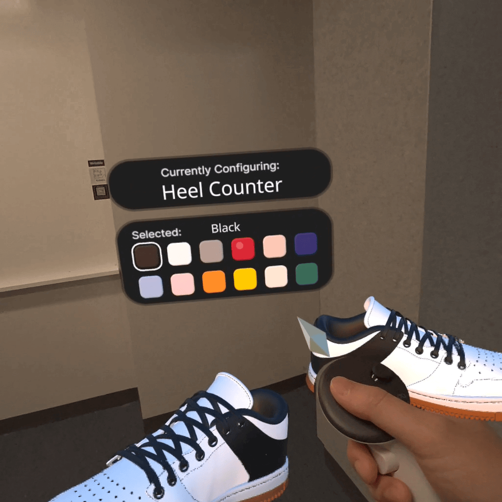

# Pitt Bradford Panther Showcase & Customizer (WebXR)

An interactive Mixed Reality and 3D web experience created for the **University of Pittsburgh at Bradford's Alumni & Family Weekend 2026**, highlighting the campus VR Lab in Marilyn Horne Hall!



## Features

- **3D Campus Panther Statue**: High-fidelity 3D photogrammetry scan of the University of Pittsburgh at Bradford Panther mascot statue.
- **Customizable Statue Finishes**:
  - **Campus Scan**: The authentic photogrammetric scan of the outdoor statue.
  - **Pitt Royal Blue**: Official UPitt Royal Blue (`#003594`) satin finish.
  - **Pitt Athletic Gold**: Official UPitt Gold (`#FFB81C`) metallic shine.
  - **Classic Cast Bronze**: Patina/bronze statue finish.
  - **White Marble**: Polished stone sculpture finish.
  - **Bradford Onyx**: Midnight dark slate stone.
- **Interactive Resizing System**:
  - Scale Presets: Desk Mini (20 cm), Tabletop (50 cm), Pedestal (1.2 m), Life-Size Statue 1:1 (2.7 m), Monumental (4.0 m).
  - Continuous slider control (0.05x to 1.5x) with fine-tuning step buttons and live metric readouts.
  - In-XR sizing panel and interactive controller scaling.
- **Mixed Reality & WebXR**:
  - Pass-through AR on Meta Quest headsets with 6DOF controller grabbing and inspection.
  - Interactive 3D OrbitControls for desktop/laptop/tablet browsers with smooth damping, zoom, and lighting.

## Running Locally

1. Install dependencies:
   ```bash
   npm install
   ```

2. Start the local HTTPS development server:
   ```bash
   npm run serve
   ```
   Open [https://localhost:8081](https://localhost:8081) in your browser or Meta Quest Browser.

3. Build production bundle:
   ```bash
   npm run build
   ```
